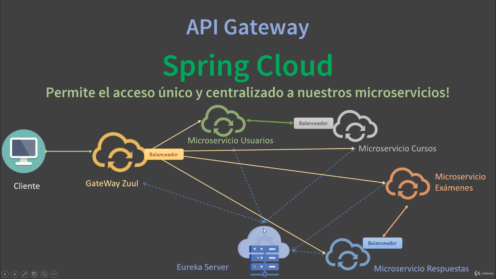

# COMPONENTES PRINCIPALES DE SPRING CLOUD

## SERVIDOR EUREKA

Este servidor es el registro de nombre. Es un servidor de nombre para registrar los microservicios, es como un contenedor de microservicios. Se necesita un nombre, un identificador único para cada microservicio, esto se configura en cada proyecto.

## BALANCEADOR DE CARGA

## API GATEWAY

Es un servidor de enrutamiento dinámico. Está compuesto por filtros, donde cada uno está enfocado en una tarea particular específica.

* Zuul Netflix y Spring Cloud Gateway
* Puerta de enlace, acceso centralizado
* Enrutamiento dinámico de los microservicios
* Balanceo de carga
* Maneja filtros propios
* Permite extender funcionalidades

