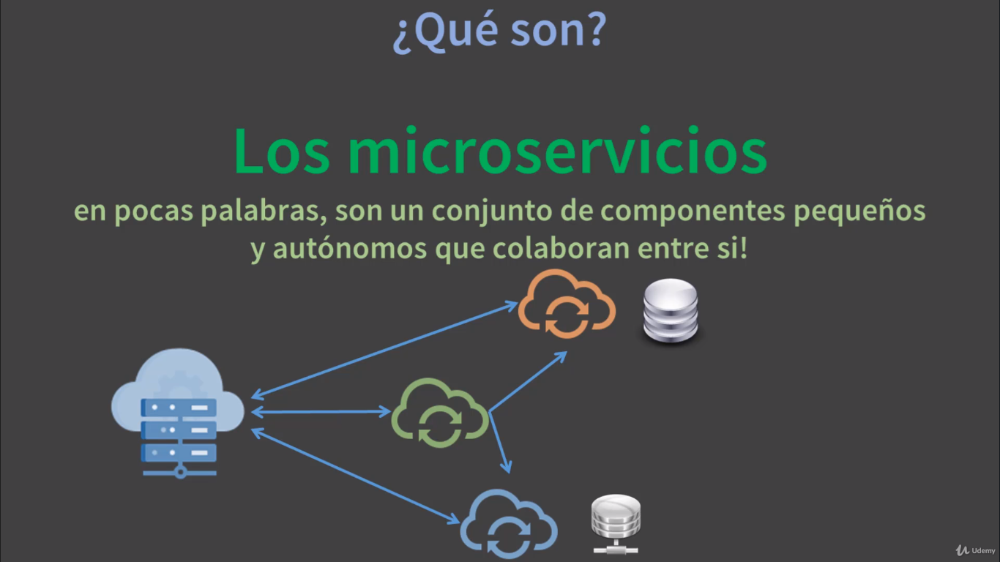

# MICROSERVICIOS CON SPRING CLOUD Y ANGULAR FRONTEND

Microservicios es una aquitectura, un enfoque que nos permite construir aplicaciones en pequeños servicios, es decir, en vez de construir una gran aplicación, un monolito que incluya todo, construimos una gran aplicación pero que está dividia en varias aplicaciones, en varios proyectos, pero estas aplicaciones o servicios se comunican entre sí, para desarrollar una gran tarea, pero cada uno desarrolla o lleva a cabo una tarea en específico.

## CARACTERÍSTICAS

- Autónomos.
- Especializados.
- Registro y auto-descubrimiento de servicios.
- Escalado flexible.
- Balanceo de cargas.
- Libertad tecnológica.
- Agilidad y equipos más pequeños.
- Ciclo de desarrollo más cortos.
- Código reutilizable.

## COMPONENTES QUE VEREMOS EN EL CURSO

### POR EL LADO BACKEND

- Spring Boot
- Spring IoC
- Spring Data JPA e Hibernate
- API REST
- Spring Cloud
- Servidor Eureka Netflix
- Eureka Cliente
- Feign
- Gateway Zuul
- Spring Cloud Gateway
- Ribbon
- Spring Cloud LoadBalancer
- Patrón de Base de Datos compartida
- Patrón de Base de Datos por servicio
- Y más...

### POR EL LADO BACKEND

- Angular CLI
- TypeScript
- Componentes
- Route
- Módulos
- Eventos o Hook
- Directivas
- Pipe
- Service y HttpCliente
- Angular Material
- Mat Paginador
- Mat Autocomplete
- Mat DataTable
- Mat Tabs
- Observable y API RxJs

## HERRAMIENTAS A UTILIZAR

- JDK (Java DEvelopment Kit).
- Spring Tools IDE (Eclipse).
- Maven.
- MariaDB (o MySQL) y PostgreSQL.
- Mongo DB
- Postman
